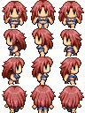

# Hello World with SFML
- Build the first moving animate app in  

## Features:

- Move Up, Down, Left, and Right an animate.
- Space for rotate 360 degree
- Animate can appear with multiple state.

## To Set Up: 
- Git clone repository.
- Set SFML environment:
[SFML](https://www.sfml-dev.org/)
- On Mac use `brew install sfml`
- Run `brew info sfml`   tofind where is sfml locate. My is `"opt/homebrew/Cellar/sfml/2.5.1_2"`. Use flag` -I` and `-L` for  `include`and `lib`.

- Run:
  - g++ main.cpp `-I/opt/homebrew/Cellar/sfml/2.5.1_2/include -L/opt/homebrew/Cellar/sfml/2.5.1_2/lib` -o main -lsfml-graphics -lsfml-window -lsfml-system
  - ./main
## Creator:
`William Vo`
## Technologies used:
- `C++`
- SFML: `Graphics`, Window, and System
